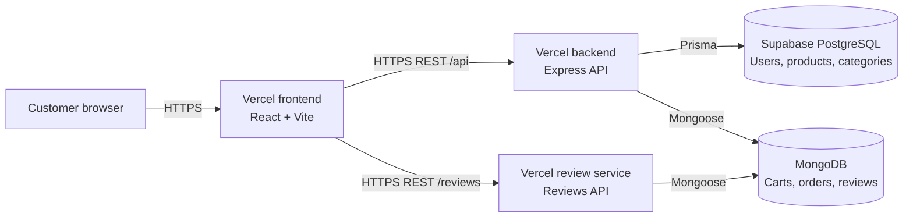

# ShopSphere

Full-stack e-commerce application built for the ShopSphere Enterprise Cloud-Native Modernization project.

## Remote repository

- Name: `EYOUTH-31005141801597-ShopSphere`
- GitHub: [iizezo99/EYOUTH-31005141801597-ShopSphere](https://github.com/iizezo99/EYOUTH-31005141801597-ShopSphere)

## Naming convention

The project follows the required naming format:

```text
Student ID-ShopSphere
```

For this project, the applied name is:

```text
EYOUTH-31005141801597-ShopSphere
```

This convention is used consistently for the repository, Kubernetes resources,
deployment projects, and project documentation.

## Technologies

- React 18
- Vite
- React Router
- Axios
- React Testing Library and Vitest
- Express 5
- Prisma ORM
- PostgreSQL
- MongoDB and Mongoose
- Independent Review Service
- JWT authentication
- Nodemailer
- Docker and Docker Compose
- Kubernetes and Kustomize
- Vercel
- GitHub Actions
- UptimeRobot

## Deployments

- Frontend: [ShopSphere Frontend](https://eyouth-31005141801597-shop-sphere-q.vercel.app)
- Backend: [ShopSphere Backend](https://eyouth-31005141801597-shop-sphere.vercel.app)
- Review service: [ShopSphere Review Service](https://eyouth-31005141801597-shop-sphere-m.vercel.app)
- Review service health: [Review Health](https://eyouth-31005141801597-shop-sphere-m.vercel.app/health)
- Backend health: [Health](https://eyouth-31005141801597-shop-sphere.vercel.app/health)
- Backend readiness: [Readiness](https://eyouth-31005141801597-shop-sphere.vercel.app/health/ready)
- Products API: [Products](https://eyouth-31005141801597-shop-sphere.vercel.app/api/products)

## Task 1 completion checklist

### 1.1 Production deployment — Done

- Frontend is deployed as a production Vercel build with a public URL.
- Backend is deployed as a production Vercel build with a public URL.
- Live frontend and backend endpoints return successful responses.

URLs:

- Frontend: https://eyouth-31005141801597-shop-sphere-q.vercel.app
- Backend: https://eyouth-31005141801597-shop-sphere.vercel.app

### 1.2 Production database — Done

- The deployed backend is configured for the production PostgreSQL database on Supabase.
- The public readiness endpoint returns `200`.
- The deployed Products API returns production data successfully.

### 1.3 Secrets and production security — Done

- Connection strings, credentials, and keys are hosted as platform environment variables.
- No secret files or secret values are tracked in the repository.
- HTTPS, strict CORS, Helmet, and API rate limiting are implemented and active.

### 1.4 Health check and uptime monitoring — Completed

- Public backend health endpoint is active: `/health` returns `200`.
- Public backend readiness endpoint is active: `/health/ready` returns `200`.
- UptimeRobot monitors the review-service health endpoint, frontend, backend health,
  and backend readiness every five minutes; all four monitors report **Up** with
  100% uptime in the current dashboard history.

## Task 2 completion checklist

### 2.1 Architecture diagram — Done

- The production architecture documents the frontend, backend, databases, review service, and traffic paths between them.
- The diagram matches the deployed Vercel and database architecture.

### 2.2 Cloud service classification — Done

- Frontend hosting on Vercel is classified as PaaS with a justification.
- Backend hosting on Vercel is classified as PaaS with a justification.
- Supabase PostgreSQL is classified as PaaS with a justification.

### 2.3 Multi-cloud namespace simulation — Done

- `aws-simulation` and `gcp-simulation` namespaces exist.
- Each namespace runs independent frontend and backend Pods.
- Each frontend and backend workload has its own Service and port.
- Both namespace overlays validate successfully with Kustomize.
- Port-forward verification succeeded for all four Services: frontend and backend in both namespaces returned `200`.
- Namespace-specific Services and Endpoints keep resources isolated between the simulations.

## Production architecture

The diagram matches the deployed ShopSphere application:



Traffic flows from the frontend to the backend and independent review service.
The backend uses Supabase PostgreSQL for relational data and MongoDB for cart
and order data; the review service uses MongoDB for product reviews.

## Secrets and production security

All connection strings, credentials, tokens, and API keys are configured as
environment variables on the hosting platforms and are not stored as secret
values in the repository.

The deployed backend has these protections enabled:

- HTTPS for encrypted production traffic
- Strict CORS allowing the production frontend origin
- Helmet security headers
- Rate limiting for API requests

The backend also uses JWT authentication, secure production cookies, request IDs,
and structured request logging.

## Seed accounts

| Role | Email | Password |
|---|---|---|
| Admin | `admin@example.com` | `123456` |
| Customer | `customer@example.com` | `123456` |

## Kubernetes simulation

The project simulates two cloud environments using separate Kubernetes namespaces
on one local Docker Desktop cluster:

- `aws-simulation`
- `gcp-simulation`

Deploy both environments:

```powershell
kubectl apply -k k8s/overlays/aws-simulation
kubectl apply -k k8s/overlays/gcp-simulation
```

### Services and port forwarding

Each Pod type is exposed by its own Service in each namespace:

| Namespace | Frontend Service | Backend Service |
|---|---|---|
| `aws-simulation` | `3000` | `5000` |
| `gcp-simulation` | `3000` | `5000` |

Forward each Service independently using different local ports. Run each
command in a separate terminal:

```powershell
# AWS simulation
kubectl -n aws-simulation port-forward service/eyouth-31005141801597-shopsphere-frontend 3001:3000
kubectl -n aws-simulation port-forward service/eyouth-31005141801597-shopsphere-backend 5001:5000

# GCP simulation
kubectl -n gcp-simulation port-forward service/eyouth-31005141801597-shopsphere-frontend 3002:3000
kubectl -n gcp-simulation port-forward service/eyouth-31005141801597-shopsphere-backend 5002:5000
```

The frontend services are then available at:

- AWS simulation: `http://localhost:3001`
- GCP simulation: `http://localhost:3002`
- AWS backend health: `http://localhost:5001/health`
- GCP backend health: `http://localhost:5002/health`

Ingress and port-forwarding are optional local access methods. The two
namespaces are used to simulate separate cloud environments on one cluster.

## CI/CD and protected main branch

GitHub Actions runs the ShopSphere CI/CD workflow on pull requests and pushes
to `main`. The `test-and-build` job runs:

- Backend tests
- Frontend tests
- Frontend production build
- AWS and GCP Kubernetes manifest validation

The `main` branch is protected. Changes should be submitted through a pull
request, and the required check is:

```text
EYOUTH-31005141801597-ShopSphere CI/CD / test-and-build
```

If the check fails, GitHub blocks the pull request from merging into `main`.
After it passes, the pull request can be merged and the production deployment
workflow can run.

## Cloud service classification

| Service | Classification | Reason |
|---|---|---|
| Frontend hosting on Vercel | PaaS | Vercel builds, hosts, and serves the React application without server management. |
| Backend hosting on Vercel | PaaS | Vercel runs the Express API as managed serverless functions. |
| Supabase PostgreSQL database | PaaS | Supabase provides a managed PostgreSQL database and its operational services. |

## Task 3: Architecture modernization

### 3.1 Review service extraction - Completed

- The review logic is separated into `services/review-service`.
- It has its own Express API, Docker image, Vercel configuration, and deployment URL:
  `https://eyouth-31005141801597-shop-sphere-m.vercel.app`
- The review data model and review endpoints are outside the main backend.
- The service currently uses MongoDB infrastructure; a separate database deployment is not independently evidenced.
- The public production health endpoint is available at `https://eyouth-31005141801597-shop-sphere-m.vercel.app/health`.

### 3.2 REST communication - Completed

- The frontend contains the review section and calls the review service through REST:
  `GET /reviews/:productId` and `POST /reviews`.
- The main ShopSphere application remains available through its production frontend and backend URLs.
- The frontend review API uses the public production review-service URL, allowing browser REST calls without the protected deployment redirect.

### 3.3 Serverless integration - Completed

- `backend/api/notify-order.js` is deployed as a protected Vercel serverless function.
- It performs notification delivery outside the normal Express route and includes CORS, authorization, rate limiting, and error handling.
- The endpoint requires the internal authorization token and configured SMTP settings before it accepts a notification.
- Scheduled jobs and webhooks are intentionally not part of this implementation.

### 3.4 Architecture decision record - Completed

**Decision 1 - Review microservice:** Move product reviews into the independently deployable
Review Service because reviews are a cohesive feature with their own API and can be changed
without redeploying the main ShopSphere application.

**Decision 2 - Notification serverless function:** Use the Vercel `notify-order` function for
protected notification delivery because email delivery is an isolated background workload and
should not expose SMTP credentials or email-processing details in the main application routes.

The project Markdown file is the one-page architecture decision record and follows the required
`Student ID-ShopSphere` naming convention.

## Task 4: Enterprise CI/CD

### 4.1 CI/CD pipeline and secrets - Completed

- GitHub Actions runs on pull requests and pushes to `main`.
- The pipeline installs dependencies, runs backend and frontend tests, builds the
  frontend, and validates both Kubernetes overlays.
- The production deployment check completed successfully through the Vercel
  deployment integration after the CI checks passed.
- Workflow files contain no credentials; production configuration is supplied by
  the hosting environments.
- The protected `main` branch requires the successful
  `EYOUTH-31005141801597-ShopSphere CI/CD / test-and-build` check before merging.

Pipeline flow:

```text
Pull request or merge to main -> Install -> Test -> Build -> Deploy -> Production
```

### 4.2 Structured logging - Completed

The backend emits structured JSON logs for production operations. Request entries
include a timestamp, request ID, HTTP method, path, status code, and duration.
Error entries include a timestamp, request ID, severity through the error channel,
and the error message. These logs are read in the Vercel project deployment logs.

### 4.3 Rollback plan - Completed

1. Detect a failed release through the public health endpoint or UptimeRobot alert.
2. Open the Vercel deployment history and identify the last deployment that passed
   the health and readiness checks.
3. Promote or redeploy that previous working deployment.
4. Confirm the frontend, backend `/health`, backend `/health/ready`, and review
   service `/health` endpoints return successful responses.
5. Confirm UptimeRobot reports all monitors as **Up**, investigate the failed
   release logs, and document the cause and prevention step.

### 4.4 Project sharing - Completed

The public project document contains all required review links:

- Frontend: https://eyouth-31005141801597-shop-sphere-q.vercel.app
- Backend: https://eyouth-31005141801597-shop-sphere.vercel.app
- Review service: https://eyouth-31005141801597-shop-sphere-m.vercel.app
- Repository: https://github.com/iizezo99/EYOUTH-31005141801597-ShopSphere

The document is stored as `EYOUTH-31005141801597-ShopSphere.md`, matching the
required project naming convention.
